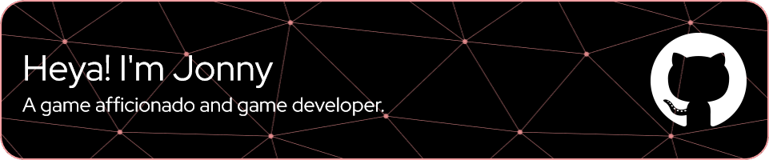

	<h3>About me</h3>
	Hello! :wave: My name is <b>Jonny</b>, I'm a 22 years old Game Dev from <b>Portugal</b> (:portugal:). 
	I was always passionate about programming and games, so why not combine both and do the best from both worlds? 
	Well, I did! I've done some freelancing and solo development in the past, but currently I'm working on a <b>Web3</b> game project.

	<h3>About my skills :ledger:</h3>
	Along my road I gathered some skills, some easy others quite the opposite.  
	<b>Languages:</b>
	

		

			
		

		The ones I feel more <b>comfortable</b> working with:
		  
		
		

		Other languages I also know:
		  
		
	

	 
	<b>Frameworks:</b>
	

		 
		The ones I feel more <b>comfortable</b> working with:
		  
		 
		 
		
		

		Other frameworks I also work on:
		  
		
	

	 
	<b>Tools:</b>
	

		 
		The ones I feel more <b>comfortable</b> working with:
		  
		 
		 
		

		I also work/worked with these:
		  
		 
		
	

